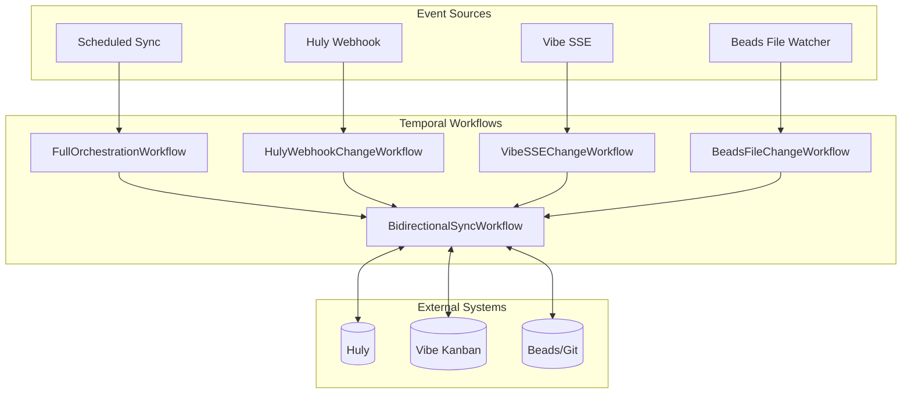
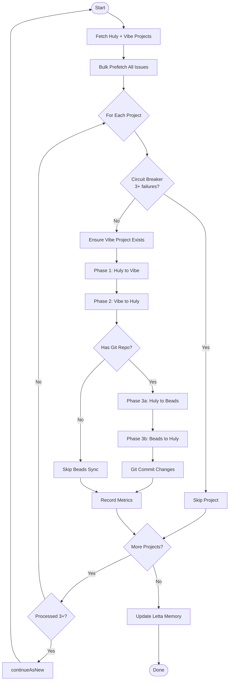
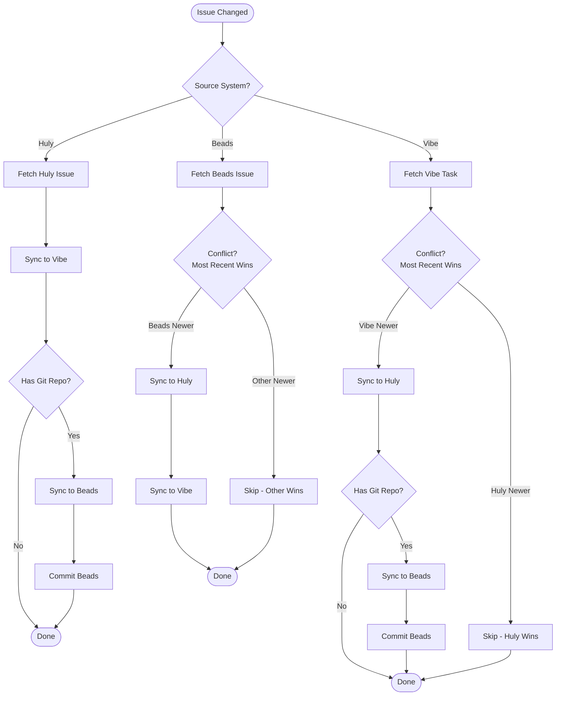
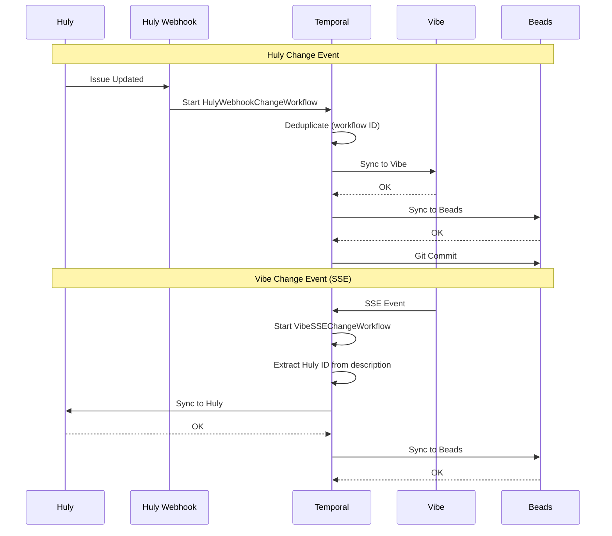
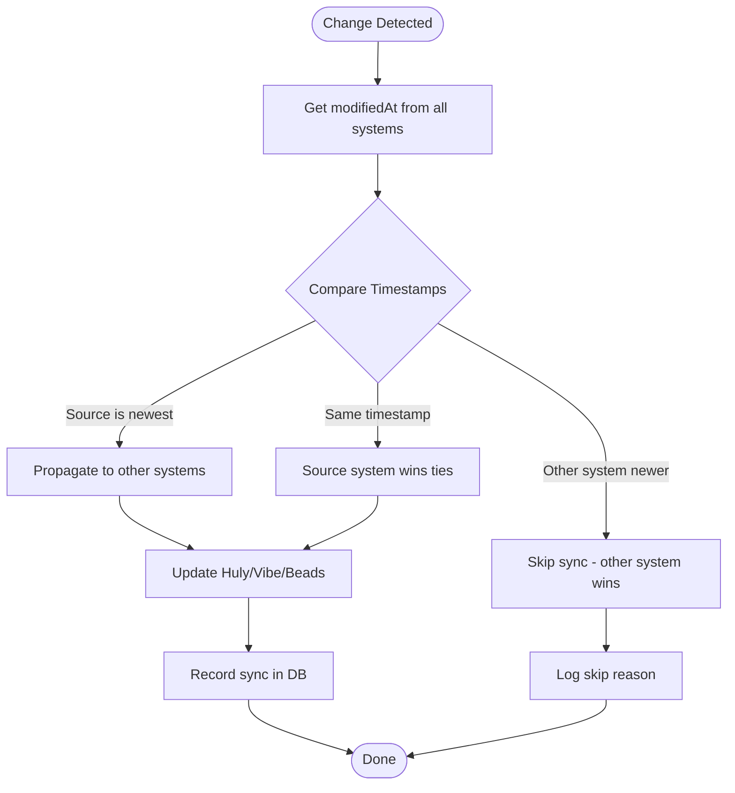
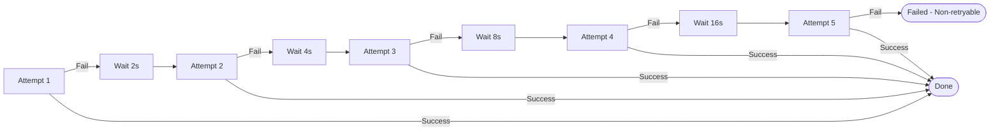

# VibeSync Flow Diagrams

Visual documentation of the bidirectional sync system.

## Overview

## Full Orchestration Workflow

Scheduled every 10 seconds. Syncs all projects.

## Bidirectional Sync Workflow

Handles single issue sync from any source.

## Webhook/SSE Event Flow

Real-time sync triggered by external events.

## Conflict Resolution

"Most recent change wins" strategy.

## Retry Policy

All Temporal activities use exponential backoff.

**Non-retryable errors** (fail immediately):

- `ValidationError` - Invalid data format
- `NotFoundError` - Issue/task doesn't exist
- `ConflictError` - Unresolvable conflict

## System Counts (Current)

| System | Count | Notes                      |
| ------ | ----- | -------------------------- |
| Huly   | 178   | Source of truth for issues |
| Vibe   | 174   | Kanban board tasks         |
| Beads  | 171   | Git-tracked local issues   |

_Last verified: 2026-01-31_
